#  WatchBuddy Provider Blueprint

[](#)
[](#)
[](https://github.com/keyiflerolsun/KekikStream/blob/master/LICENSE)

**Official SDK and Boilerplate for WatchBuddy Content Providers**  
Build decentralized scrapers, test them in isolation, and integrate seamlessly with the WatchBuddy ecosystem. 🚀

[🇹🇷 Türkçe dokümantasyon (README_TR.md)](./README_TR.md)

---

## 🚦 Overview

This blueprint provides a standardized environment for developing **WatchBuddy Providers**. A Provider is a standalone service that supplies content to WatchBuddy (Web/Mobile) through a decentralized network.

- 🔌 **Plug & Play**: Add your provider URL to WatchBuddy and start watching.
- 🧪 **Isolated Development**: Local-first architecture allows you to test your plugins without affecting the core system.
- 🎬 **Unified Media Core**: Powered by KekikStream for advanced link extraction.
- 🛡️ **CORS Friendly**: Works with standard CORS/proxy setups when needed.

---

## 🚀 Quick Start

> Prerequisites: Python 3.11+. No external media players required for development.

```bash
# 1. Clone the repository
git clone https://github.com/keyiflerolsun/ExampleProvider.git
cd ExampleProvider

# 2. Install dependencies
pip install -r requirements.txt

# 3. Setup environment
cp .env.example .env

# 4. Start the engine
python run.py
```

👉 **Access Provider:** `http://127.0.0.1:3310`  
👉 **WatchBuddy Integration:** Copy this URL into the "Providers" section of your WatchBuddy App.

### ✅ Add Your Provider to WatchBuddy
1. Open WatchBuddy.
2. Go to **Providers**.
3. Paste your base URL (e.g. `http://127.0.0.1:3310`).
4. Save and enable the provider.

Requirements:
- Your provider must expose `GET /api/v1/schema`.
- The response must include `provider_name` and `description` (plus optional proxy URLs).

---

## 📂 Project Structure

```text
.
├── Stream/
│   ├── Plugins/      # 🔌 Your Website Scrapers (e.g., RareFilmm.py)
│   └── Extractors/   # 🔗 Your Link Resolvers (e.g., OneFichier.py)
├── FastAPI/          # ⚡ Provider API Core
├── run.py            # 🚀 Main entry point
├── validate.py       # 🧪 Plugin testing & validation tool
└── .env              # ⚙️ Configuration
```

### 🔌 Component System
| Component | Responsibility | Folder |
|-----------|----------------|--------|
| **Plugin** | Browsing the site, fetching metadata and embed URLs. | `Stream/Plugins/` |
| **Extractor** | Resolving final playable links from hosting providers. | `Stream/Extractors/` |

---

## 🛠️ Developer Guide

### 1. How to Create a Plugin
Creating a new plugin is as simple as adding a Python file to `Stream/Plugins/`. Here is a minimal boilerplate:

```python
from KekikStream.Core import PluginBase, MainPageResult, SearchResult, MovieInfo

class MyAwesomeProvider(PluginBase):
    name        = "My Provider"
    main_url    = "https://example.com"
    description = "Short description of the provider."

    async def get_main_page(self, page, url, category) -> list[MainPageResult]:
        # Scrape and return list of MainPageResult
        pass

    async def search(self, query) -> list[SearchResult]:
        # Return list of SearchResult
        pass

    async def load_item(self, url) -> MovieInfo:
        # Return MovieInfo or SeriesInfo
        pass

    async def load_links(self, url) -> list:
        # Resolve playable links
        pass
```

### 2. Testing your Plugins
Use the built-in validator to ensure your plugins are compliant with the WatchBuddy models. It tests Discovery, Search, Metadata, and Stream extraction automatically.
```bash
# Test all local plugins
python validate.py

# Test specific plugins
python validate.py RareFilmm
```

### 3. Local-First Priority
This SDK uses a **Local-First** loader. When running from this directory:
- **Local Plugins** (`Stream/Plugins/`) are loaded exclusively.
- **Local Extractors** (`Stream/Extractors/`) can be used to override or extend core extractors.
- This ensures your development environment is 100% reproducible and isolated.

### 📚 Reference Implementations
Looking for inspiration? Explore the core KekikStream library for professional examples:
- 🔌 [Core Plugins](https://github.com/keyiflerolsun/KekikStream/tree/master/KekikStream/Plugins)
- 🔗 [Core Extractors](https://github.com/keyiflerolsun/KekikStream/tree/master/KekikStream/Extractors)

### 📋 Standard Models
Your plugins MUST return these standard models to be compatible with WatchBuddy:
- `MainPageResult`: For home screen galleries.
- `SearchResult`: For search results.
- `MovieInfo` / `SeriesInfo`: For metadata and episodes.
- `ExtractResult`: For playable links (includes referer and user-agent).

---

## ✨ System Architecture

```mermaid
graph TB
    subgraph WatchBuddyApp[📱 WatchBuddy Client]
        UI[User Interface]
        Player[Video Player]
    end

    subgraph Provider[🎬 Your Provider]
        FastAPI[⚡ FastAPI Entry]
        Loader[🔌 Loader Core]

        subgraph LocalCode[Local Development]
            P1[📺 RareFilmm Plugin]
            E1[🔗 Custom Extractor]
        end
    end

    subgraph External[🌍 Web]
        Target[Media Website]
        CDN[Raw Stream CDN]
    end

    UI -->|Search/Load| FastAPI
    FastAPI --> Loader
    Loader --> P1
    P1 -->|Scrape| Target
    P1 -->|Request Link| E1
    E1 -->|Resolve| CDN
    CDN -->|Stream| Player

    style Provider fill:#2b2a29,stroke:#ef7f1a,stroke-width:2px
    style WatchBuddyApp fill:#242322,stroke:#0087a3,stroke-width:2px
```



---

## 🌐 Copyright & License

*Copyright (C) 2026 by* [keyiflerolsun](https://github.com/keyiflerolsun) ❤️️  
Licensed under [GNU GENERAL PUBLIC LICENSE Version 3](https://github.com/keyiflerolsun/KekikStream/blob/master/LICENSE).

---

<p align="center">
  This project is developed by <a href="https://github.com/keyiflerolsun">@keyiflerolsun</a> for <a href="https://t.me/KekikAkademi">@KekikAkademi</a>.
</p>

<p align="center">
  <sub>⭐ If you find this SDK useful, don't forget to give it a star!</sub>
</p>
