#  Plan Fournisseur WatchBuddy

[](#)
[](https://keyiflerolsun.tr/http-protocol-redirector/?r=watchbuddy://provider?url=https://example.watchbuddy.tv)
[](#)
[](https://github.com/keyiflerolsun/KekikStream/blob/master/LICENSE)

**SDK officiel et boilerplate pour les fournisseurs de contenu WatchBuddy**
Construisez des scrapers decentralises, testez-les en isolation, puis integrez-les proprement dans l'ecosysteme WatchBuddy. 🚀

[🇺🇸 English](./README.md) • [🇹🇷 Türkçe](./README_TR.md) • [🇷🇺 Русский](./README_RU.md) • [🇺🇦 Українська](./README_UK.md)

---

## 🚦 Vue d'ensemble

Ce blueprint fournit un environnement standardise pour developper des **fournisseurs WatchBuddy**. Un fournisseur est un service autonome qui alimente WatchBuddy (Web/Mobile) via un reseau decentralise.

- 🔌 **Plug & Play**: ajoutez l'URL de votre fournisseur a WatchBuddy et commencez a regarder.
- 🧪 **Developpement isole**: architecture local-first pour tester vos plugins sans impacter le coeur du systeme.
- 🎬 **Noyau media unifie**: propulse par KekikStream pour l'extraction avancee de liens.
- 🛡️ **Compatible CORS**: fonctionne avec des configurations CORS/proxy standards si necessaire.

---

## 🚀 Demarrage rapide

> Prerequis: Python 3.11+. Aucun lecteur media externe n'est requis pour le developpement.

```bash
# 1. Cloner le depot
git clone https://github.com/keyiflerolsun/ExampleProvider.git
cd ExampleProvider

# 2. Installer les dependances
pip install -r requirements.txt

# 3. Configurer l'environnement
cp .env.example .env

# 4. Demarrer le moteur
python run.py
```

👉 **Acces fournisseur:** `http://127.0.0.1:3310`
👉 **Integration WatchBuddy (localhost):** [Ajouter http://localhost:3310 a WatchBuddy](https://keyiflerolsun.tr/http-protocol-redirector/?r=watchbuddy://provider?url=http://localhost:3310)

### ✅ Ajouter votre fournisseur a WatchBuddy
1. Ouvrez WatchBuddy.
2. Allez dans **Providers**.
3. Collez votre URL de base (ex. `http://127.0.0.1:3310`).
4. Enregistrez et activez le fournisseur.

Exigences:
- Votre fournisseur doit exposer `GET /api/v1/schema`.
- La reponse doit inclure `provider_name` et `description` (avec URL proxy optionnelles).

---

## 📂 Structure du projet

```text
.
├── Stream/
│   ├── Plugins/      # 🔌 Vos scrapers de sites (ex: RareFilmm.py)
│   └── Extractors/   # 🔗 Vos resolvers de liens (ex: OneFichier.py)
├── FastAPI/          # ⚡ Noyau API du fournisseur
├── run.py            # 🚀 Point d'entree principal
├── validate.py       # 🧪 Outil de test et validation
└── .env              # ⚙️ Configuration
```

### 🔌 Systeme de composants
| Composant | Responsabilite | Dossier |
|-----------|----------------|---------|
| **Plugin** | Parcourir le site, recuperer les metadonnees et les URLs embed. | `Stream/Plugins/` |
| **Extractor** | Resoudre les liens finaux lisibles depuis les hebergeurs. | `Stream/Extractors/` |

---

## 🛠️ Guide developpeur

### 1. Creer un plugin
Creer un plugin revient a ajouter un fichier Python dans `Stream/Plugins/`. Exemple minimal:

```python
from KekikStream.Core import HTMLHelper, PluginBase, MainPageResult, SearchResult, MovieInfo, Episode, SeriesInfo, Subtitle, ExtractResult

class MyPlugin(PluginBase):
    name        = "MyPlugin"
    language    = "fr"
    main_url    = "https://example.com"
    favicon     = f"https://www.google.com/s2/favicons?domain={main_url}&sz=64"
    description = "Description de MyPlugin"

    # Liste des categories en page d'accueil
    main_page   = {
      f"{main_url}/category/" : "Nom de categorie"
    }

    async def get_main_page(self, page: int, url: str, category: str) -> list[MainPageResult]:
        # Scraper puis retourner une liste de MainPageResult
        return results

    async def search(self, query: str) -> list[SearchResult]:
        # Retourner une liste de SearchResult
        return results

    async def load_item(self, url: str) -> MovieInfo | SeriesInfo:
        # Retourner MovieInfo ou SeriesInfo
        return details

    async def load_links(self, url: str) -> list[ExtractResult]:
        # self.collect_results(results, data)  — collecter les resultats (list/single/None)
        # self.deduplicate(results)             — deduplication par URL
        # await self.async_cf_get(url)          — bypass Cloudflare (async)
        # Le moteur appelle sync_subtitles(results) automatiquement apres load_links
        return links
```

### 2. Tester vos plugins
Utilisez le validateur integre pour verifier la conformite avec les modeles WatchBuddy.

```bash
# Tester tous les plugins locaux
python validate.py

# Tester des plugins specifiques
python validate.py RareFilmm
```

### 3. Priorite Local-First
Ce SDK utilise un chargeur **Local-First**:
- les **plugins locaux** (`Stream/Plugins/`) sont charges en priorite;
- les **extracteurs locaux** (`Stream/Extractors/`) peuvent surcharger ou etendre les extracteurs du coeur;
- votre environnement reste 100% reproductible et isole.

### 📚 Implementations de reference
- 🔌 [Plugins coeur](https://github.com/keyiflerolsun/KekikStream/tree/master/KekikStream/Plugins)
- 🔗 [Extracteurs coeur](https://github.com/keyiflerolsun/KekikStream/tree/master/KekikStream/Extractors)

### 📋 Modeles standards
Vos plugins DOIVENT retourner ces modeles:
- `MainPageResult`: galeries page d'accueil
- `SearchResult`: resultats de recherche
- `MovieInfo` / `SeriesInfo`: metadonnees et episodes
- `ExtractResult`: liens lisibles (inclut referer et user-agent)

---

## ✨ Architecture systeme

```mermaid
graph TB
    subgraph WatchBuddyApp[📱 Client WatchBuddy]
        UI[Interface utilisateur]
        Player[Lecteur video]
    end

    subgraph Provider[🎬 Votre fournisseur]
        FastAPI[⚡ Entree FastAPI]
        Loader[🔌 Coeur Loader]

        subgraph LocalCode[Code local]
            P1[📺 Plugin RareFilmm]
            E1[🔗 Extracteur personnalise]
        end
    end

    subgraph External[🌍 Web]
        Target[Site media]
        CDN[CDN de flux brut]
    end

    UI -->|Recherche/Chargement| FastAPI
    FastAPI --> Loader
    Loader --> P1
    P1 -->|Scraping| Target
    P1 -->|Demande de lien| E1
    E1 -->|Resolution| CDN
    CDN -->|Flux| Player

    style Provider fill:#2b2a29,stroke:#ef7f1a,stroke-width:2px
    style WatchBuddyApp fill:#242322,stroke:#0087a3,stroke-width:2px
```



---

## 🌐 Copyright et licence

*Copyright (C) 2026 par* [keyiflerolsun](https://github.com/keyiflerolsun) ❤️️
Distribue sous [GNU GENERAL PUBLIC LICENSE Version 3](https://github.com/keyiflerolsun/KekikStream/blob/master/LICENSE).

---

<p align="center">
  Ce projet est developpe par <a href="https://github.com/keyiflerolsun">@keyiflerolsun</a> pour <a href="https://t.me/KekikAkademi">@KekikAkademi</a>.
</p>

<p align="center">
  <sub>⭐ Si ce SDK vous est utile, pensez a lui donner une etoile.</sub>
</p>
