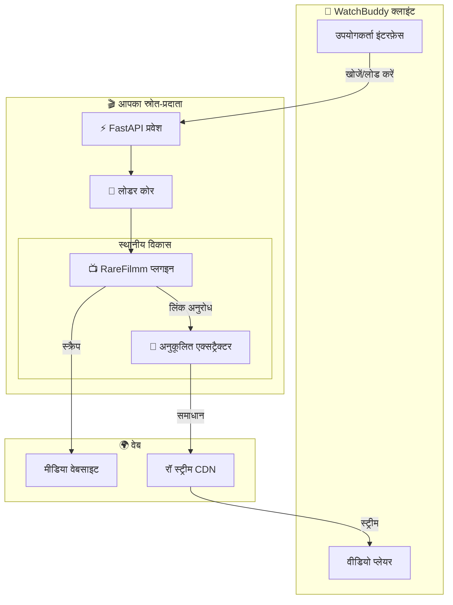

#  WatchBuddy प्रदाता ब्लूप्रिंट

[](#)
[](https://keyiflerolsun.tr/http-protocol-redirector/?r=watchbuddy://provider?url=https://example.watchbuddy.tv)
[](#)
[](https://github.com/keyiflerolsun/KekikStream/blob/master/LICENSE)

**WatchBuddy कंटेंट प्रदाताओं के लिए आधिकारिक SDK और शुरुआती ढांचा**
विकेंद्रीकृत स्क्रेपर बनाइए, उन्हें अलग वातावरण में परखिए, और बिना अतिरिक्त झंझट के WatchBuddy इकोसिस्टम से जोड़िए।

[🇺🇸 English](./README.md) • [🇹🇷 Türkçe](./README_TR.md) • [🇫🇷 Français](./README_FR.md) • [🇷🇺 Русский](./README_RU.md) • [🇺🇦 Українська](./README_UK.md) • [🇮🇳 हिन्दी](./README_HI.md) • [🇨🇳 简体中文](./README_ZH.md)

---

## 🚦 परिचय

यह ब्लूप्रिंट WatchBuddy के लिए मानकीकृत प्रदाता सेवा बनाने की बुनियाद देता है। प्रदाता एक स्वतंत्र सेवा होती है, जो विकेंद्रीकृत नेटवर्क के माध्यम से WatchBuddy के वेब और मोबाइल क्लाइंट तक सामग्री पहुँचाती है।

- 🔌 **तुरंत जोड़ें:** अपना प्रदाता URL WatchBuddy में जोड़ें और तुरंत इस्तेमाल शुरू करें।
- 🧪 **अलग विकास वातावरण:** लोकल-फर्स्ट संरचना आपको मुख्य सिस्टम से अलग रहकर प्लगइन परखने देती है।
- 🎬 **मजबूत मीडिया कोर:** उन्नत लिंक निष्कर्षण के लिए KekikStream पर आधारित।
- 🛡️ **CORS के साथ अनुकूल:** ज़रूरत पड़ने पर सामान्य CORS या प्रॉक्सी व्यवस्था के साथ काम करता है।

---

## 🚀 त्वरित शुरुआत

> आवश्यकताएँ: Python 3.11+। विकास के लिए किसी बाहरी मीडिया प्लेयर की ज़रूरत नहीं है।

```bash
# 1. रिपॉज़िटरी क्लोन करें
git clone https://github.com/keyiflerolsun/ExampleProvider.git
cd ExampleProvider

# 2. निर्भरताएँ स्थापित करें
pip install .

# 3. परिवेश तैयार करें
cp .env.example .env

# 4. सेवा शुरू करें
python run.py
```

👉 **प्रदाता पता:** http://127.0.0.1:3310
👉 **WatchBuddy स्थानीय एकीकरण:** https://keyiflerolsun.tr/http-protocol-redirector/?r=watchbuddy://provider?url=http://localhost:3310

### ✅ अपना प्रदाता WatchBuddy में जोड़ें
1. WatchBuddy खोलें।
2. प्रदाता अनुभाग में जाएँ।
3. अपना बेस URL चिपकाएँ, जैसे http://127.0.0.1:3310।
4. सहेजें और प्रदाता सक्रिय करें।

आवश्यकताएँ:
- प्रदाता को GET /api/v1/schema उपलब्ध कराना होगा।
- प्रतिक्रिया में provider_name और description फ़ील्ड होने चाहिए। प्रॉक्सी URL वैकल्पिक हैं।

### 📱 इकोसिस्टम देखें

WatchBuddy Android और iOS पर उपलब्ध है।

ज़्यादा शीर्षक खोजने और उन्हें जल्दी से कमरे में भेजने के लिए आप इन सेवाओं का भी उपयोग कर सकते हैं:
- 🌐 Stream वेब: https://stream.watchbuddy.tv
- 🤖 Telegram बॉट: https://t.me/WatchBuddyRobot

---

## 📂 प्रोजेक्ट संरचना

```text
.
├── Stream/
│   ├── Plugins/      # आपकी साइट स्क्रेपर फ़ाइलें
│   └── Extractors/   # आपके लिंक समाधानकर्ता
├── FastAPI/          # प्रदाता API कोर
├── run.py            # मुख्य प्रवेश बिंदु
├── validate.py       # परीक्षण और सत्यापन उपकरण
└── .env              # विन्यास
```

### 🔌 घटक प्रणाली
| घटक | ज़िम्मेदारी | फ़ोल्डर |
|------|-------------|---------|
| Plugin | साइट ब्राउज़ करना, मेटाडेटा और एम्बेड URL लाना | Stream/Plugins/ |
| Extractor | होस्टिंग सेवाओं से अंतिम चलने योग्य लिंक निकालना | Stream/Extractors/ |

---

## 🛠️ डेवलपर गाइड

### 1. नया प्लगइन कैसे बनाएँ
नया प्लगइन बनाना उतना ही सरल है जितना Stream/Plugins/ में एक Python फ़ाइल जोड़ना। न्यूनतम उदाहरण:

```python
from KekikStream.Core import HTMLHelper, PluginBase, MainPageResult, SearchResult, MovieInfo, Episode, SeriesInfo, Subtitle, ExtractResult

class MyPlugin(PluginBase):
    name        = "MyPlugin"
    language    = "hi"
    main_url    = "https://example.com"
    favicon     = f"https://www.google.com/s2/favicons?domain={main_url}&sz=64"
    description = "MyPlugin विवरण"

    main_page   = {
      f"{main_url}/category/" : "श्रेणी नाम"
    }

    async def get_main_page(self, page: int, url: str, category: str) -> list[MainPageResult]:
        return results

    async def search(self, query: str) -> list[SearchResult]:
        return results

    async def load_item(self, url: str) -> MovieInfo | SeriesInfo:
        return details

    async def load_links(self, url: str) -> list[ExtractResult]:
        return links
```

### 2. प्लगइनों का परीक्षण
बिल्ट-इन validator का उपयोग करें, ताकि यह सुनिश्चित हो सके कि आपका प्लगइन WatchBuddy मॉडलों के साथ संगत है।

```bash
python validate.py
python validate.py RareFilmm
```

### 3. लोकल-फर्स्ट प्राथमिकता
यह SDK लोकल-फर्स्ट लोडर का उपयोग करता है:
- स्थानीय Plugins को प्राथमिकता से लोड किया जाता है।
- स्थानीय Extractors, core extractors को बढ़ा या ओवरराइड कर सकते हैं।
- इससे आपका विकास वातावरण पुनरुत्पाद्य और अलग बना रहता है।

### 📚 संदर्भ कार्यान्वयन
- 🔌 https://github.com/keyiflerolsun/KekikStream/tree/master/KekikStream/Plugins
- 🔗 https://github.com/keyiflerolsun/KekikStream/tree/master/KekikStream/Extractors

### 📋 मानक मॉडल
WatchBuddy संगतता के लिए प्लगइनों को ये मॉडल लौटाने चाहिए:
- MainPageResult
- SearchResult
- MovieInfo / SeriesInfo
- ExtractResult

---

## ✨ सिस्टम संरचना



---

## 🌐 लाइसेंस

Copyright (C) 2026 by keyiflerolsun.
GNU GENERAL PUBLIC LICENSE Version 3 के अंतर्गत लाइसेंस प्राप्त।

---

<p align="center">
    यह प्रोजेक्ट <a href="https://github.com/keyiflerolsun">@keyiflerolsun</a> द्वारा <a href="https://t.me/KekikAkademi">@KekikAkademi</a> के लिए विकसित किया गया है।
</p>
