#  Шаблон провайдера WatchBuddy

[](#)
[](https://keyiflerolsun.tr/http-protocol-redirector/?r=watchbuddy://provider?url=https://example.watchbuddy.tv)
[](#)
[](https://github.com/keyiflerolsun/KekikStream/blob/master/LICENSE)

**Официальный SDK и boilerplate для контент-провайдеров WatchBuddy**  
Создавайте децентрализованные скрейперы, тестируйте их изолированно и без лишних шагов интегрируйте в экосистему WatchBuddy. 🚀

[🇺🇸 English](./README.md) • [🇹🇷 Türkçe](./README_TR.md) • [🇫🇷 Français](./README_FR.md) • [🇺🇦 Українська](./README_UK.md)

---

## 🚦 Обзор

Этот шаблон дает стандартизированную среду для разработки **провайдеров WatchBuddy**.  
Провайдер — это отдельный сервис, который поставляет контент в WatchBuddy (Web/Mobile) через децентрализованную сеть.

- 🔌 **Plug & Play**: добавьте URL провайдера в WatchBuddy и сразу начинайте смотреть.
- 🧪 **Изолированная разработка**: архитектура local-first позволяет тестировать плагины без влияния на ядро.
- 🎬 **Единое медиаядро**: на базе KekikStream для расширенного извлечения ссылок.
- 🛡️ **Дружелюбно к CORS**: работает со стандартными CORS/proxy-сценариями при необходимости.

---

## 🚀 Быстрый старт

> Требования: Python 3.11+. Для разработки не нужны внешние медиаплееры.

```bash
# 1. Клонируйте репозиторий
git clone https://github.com/keyiflerolsun/ExampleProvider.git
cd ExampleProvider

# 2. Установите зависимости
pip install -r requirements.txt

# 3. Настройте окружение
cp .env.example .env

# 4. Запустите движок
python run.py
```

👉 **Доступ к провайдеру:** `http://127.0.0.1:3310`  
👉 **Интеграция с WatchBuddy (localhost):** [Добавить http://localhost:3310 в WatchBuddy](https://keyiflerolsun.tr/http-protocol-redirector/?r=watchbuddy://provider?url=http://localhost:3310)

### ✅ Как добавить провайдера в WatchBuddy
1. Откройте WatchBuddy.
2. Перейдите в раздел **Providers**.
3. Вставьте базовый URL (например, `http://127.0.0.1:3310`).
4. Сохраните и активируйте провайдер.

Требования:
- Провайдер должен отдавать `GET /api/v1/schema`.
- В ответе должны быть `provider_name` и `description` (плюс опциональные proxy URL).

---

## 📂 Структура проекта

```text
.
├── Stream/
│   ├── Plugins/      # 🔌 Ваши скрейперы сайтов (например, RareFilmm.py)
│   └── Extractors/   # 🔗 Ваши резолверы ссылок (например, OneFichier.py)
├── FastAPI/          # ⚡ Ядро API провайдера
├── run.py            # 🚀 Основная точка входа
├── validate.py       # 🧪 Инструмент тестирования и валидации
└── .env              # ⚙️ Конфигурация
```

### 🔌 Компонентная система
| Компонент | Ответственность | Папка |
|-----------|-----------------|------|
| **Plugin** | Обход сайта, получение метаданных и embed URL. | `Stream/Plugins/` |
| **Extractor** | Получение финальных воспроизводимых ссылок у хостинг-провайдеров. | `Stream/Extractors/` |

---

## 🛠️ Руководство разработчика

### 1. Как создать плагин
Создать новый плагин просто: добавьте Python-файл в `Stream/Plugins/`. Минимальный пример:

```python
from KekikStream.Core import PluginBase, MainPageResult, SearchResult, MovieInfo, SeriesInfo, ExtractResult

class MyPlugin(PluginBase):
    name        = "MyPlugin"
    language    = "ru"
    main_url    = "https://example.com"
    favicon     = f"https://www.google.com/s2/favicons?domain={main_url}&sz=64"
    description = "Описание MyPlugin"

    # Список категорий на главной
    main_page   = {
      f"{main_url}/category/" : "Название категории"
    }

    async def get_main_page(self, page: int, url: str, category: str) -> list[MainPageResult]:
        # Соберите данные и верните список MainPageResult
        return results

    async def search(self, query: str) -> list[SearchResult]:
        # Верните список SearchResult
        return results

    async def load_item(self, url: str) -> MovieInfo | SeriesInfo:
        # Верните MovieInfo или SeriesInfo
        return details

    async def load_links(self, url: str) -> list[ExtractResult]:
        # Разрешите воспроизводимые ссылки
        return links
```

### 2. Тестирование плагинов
Используйте встроенный валидатор, чтобы проверить совместимость с моделями WatchBuddy.

```bash
# Проверить все локальные плагины
python validate.py

# Проверить конкретные плагины
python validate.py RareFilmm
```

### 3. Приоритет Local-First
Этот SDK использует загрузчик **Local-First**:
- **локальные плагины** (`Stream/Plugins/`) загружаются приоритетно;
- **локальные экстракторы** (`Stream/Extractors/`) могут переопределять или расширять core extractors;
- среда разработки остается полностью воспроизводимой и изолированной.

### 📚 Референсные реализации
- 🔌 [Core Plugins](https://github.com/keyiflerolsun/KekikStream/tree/master/KekikStream/Plugins)
- 🔗 [Core Extractors](https://github.com/keyiflerolsun/KekikStream/tree/master/KekikStream/Extractors)

### 📋 Стандартные модели
Для совместимости с WatchBuddy плагины ДОЛЖНЫ возвращать:
- `MainPageResult`: для галерей на главной.
- `SearchResult`: для результатов поиска.
- `MovieInfo` / `SeriesInfo`: для метаданных и эпизодов.
- `ExtractResult`: для воспроизводимых ссылок (включая referer и user-agent).

---

## ✨ Архитектура системы

```mermaid
graph TB
    subgraph WatchBuddyApp[📱 Клиент WatchBuddy]
        UI[Пользовательский интерфейс]
        Player[Видеоплеер]
    end

    subgraph Provider[🎬 Ваш провайдер]
        FastAPI[⚡ Точка входа FastAPI]
        Loader[🔌 Ядро загрузчика]

        subgraph LocalCode[Локальная разработка]
            P1[📺 Плагин RareFilmm]
            E1[🔗 Пользовательский экстрактор]
        end
    end

    subgraph External[🌍 Веб]
        Target[Медиа-сайт]
        CDN[CDN с потоками]
    end

    UI -->|Поиск/Загрузка| FastAPI
    FastAPI --> Loader
    Loader --> P1
    P1 -->|Скрапинг| Target
    P1 -->|Запрос ссылки| E1
    E1 -->|Разрешение| CDN
    CDN -->|Поток| Player

    style Provider fill:#2b2a29,stroke:#ef7f1a,stroke-width:2px
    style WatchBuddyApp fill:#242322,stroke:#0087a3,stroke-width:2px
```



---

## 🌐 Авторские права и лицензия

*Copyright (C) 2026 by* [keyiflerolsun](https://github.com/keyiflerolsun) ❤️️  
Лицензия: [GNU GENERAL PUBLIC LICENSE Version 3](https://github.com/keyiflerolsun/KekikStream/blob/master/LICENSE).

---

<p align="center">
  Проект разработан <a href="https://github.com/keyiflerolsun">@keyiflerolsun</a> для <a href="https://t.me/KekikAkademi">@KekikAkademi</a>.
</p>

<p align="center">
  <sub>⭐ Если SDK оказался полезным, поддержите проект звездой.</sub>
</p>
