#  WatchBuddy Sağlayıcı Taslağı

[](#)
[](https://keyiflerolsun.tr/http-protocol-redirector/?r=watchbuddy://provider?url=https://example.watchbuddy.tv)
[](#)
[](https://github.com/keyiflerolsun/KekikStream/blob/master/LICENSE)

**WatchBuddy İçerik Sağlayıcıları için Resmi SDK ve Başlangıç Paketi**
Merkeziyetsiz tarayıcılar oluşturun, izole ortamda test edin ve WatchBuddy ekosistemine sorunsuz entegre olun. 🚀

[🇺🇸 English](./README.md) • [🇫🇷 Français](./README_FR.md) • [🇷🇺 Русский](./README_RU.md) • [🇺🇦 Українська](./README_UK.md)

---

## 🚦 Ne Sunar?

Bu taslak, **WatchBuddy Sağlayıcıları** geliştirmek için standartlaştırılmış bir ortam sunar. Bir Sağlayıcı, merkeziyetsiz bir ağ üzerinden WatchBuddy (Web/Mobil) uygulamalarına içerik sağlayan bağımsız bir servistir.

- 🔌 **Tak ve Çalıştır**: Sağlayıcı URL'nizi WatchBuddy'ye ekleyin ve hemen izlemeye başlayın.
- 🧪 **İzole Geliştirme**: Yerel öncelikli mimari sayesinde, çekirdek sistemi etkilemeden eklentilerinizi test edin.
- 🎬 **Birleşik Medya Çekirdeği**: Gelişmiş link çıkarımı için KekikStream gücüyle donatılmıştır.
- 🛡️ **CORS Uyumlu**: Gerekirse standart CORS/proxy kurulumlarıyla çalışır.

---

## 🚀 Hızlı Başlangıç

> Gereksinimler: Python 3.11+. Geliştirme sürecinde harici medya oynatıcılarına ihtiyaç yoktur.

```bash
# 1. Depoyu klonlayın
git clone https://github.com/keyiflerolsun/ExampleProvider.git
cd ExampleProvider

# 2. Bağımlılıkları yükleyin
pip install -r requirements.txt

# 3. Ayarları yapılandırın
cp .env.example .env

# 4. Servisi başlatın
python run.py
```

👉 **Sağlayıcı Erişimi:** `http://127.0.0.1:3310`
👉 **WatchBuddy Entegrasyonu (Localhost):** [http://localhost:3310'u WatchBuddy'ye Ekle](https://keyiflerolsun.tr/http-protocol-redirector/?r=watchbuddy://provider?url=http://localhost:3310)

### ✅ Sağlayıcıyı WatchBuddy’ye Ekleme
1. WatchBuddy’i açın.
2. **Providerlar** bölümüne gidin.
3. Base URL’i yapıştırın (örn. `http://127.0.0.1:3310`).
4. Kaydedip sağlayıcıyı etkinleştirin.

Gereksinimler:
- Sağlayıcı `GET /api/v1/schema` endpoint’ini sunmalıdır.
- Cevapta `provider_name` ve `description` alanları bulunmalıdır (opsiyonel proxy URL’leri dahil edilebilir).

---

## 📂 Proje Yapısı

```text
.
├── Stream/
│   ├── Plugins/      # 🔌 Web Sitesi Tarayıcılarınız (Örn: RareFilmm.py)
│   └── Extractors/   # 🔗 Link Çözücüleriniz (Örn: OneFichier.py)
├── FastAPI/          # ⚡ Sağlayıcı API Çekirdeği
├── run.py            # 🚀 Ana giriş noktası
├── validate.py       # 🧪 Test ve doğrulama aracı
└── .env              # ⚙️ Konfigürasyon
```

### 🔌 Bileşen Sistemi
| Bileşen | Sorumluluk | Klasör |
|-----------|----------------|--------|
| **Plugin** | Siteyi tarama, meta verileri ve embed linklerini getirme. | `Stream/Plugins/` |
| **Extractor** | Hosting servislerinden oynatılabilir final linklerini çözme. | `Stream/Extractors/` |

---

## 🛠️ Geliştirici Kılavuzu

### 1. Yeni Bir Eklenti (Plugin) Oluşturma
Yeni bir eklenti oluşturmak, `Stream/Plugins/` dizinine bir Python dosyası eklemek kadar basittir. İşte temel bir taslak:

```python
from KekikStream.Core import PluginBase, MainPageResult, SearchResult, MovieInfo, SeriesInfo, ExtractResult

class MyPlugin(PluginBase):
    name        = "MyPlugin"
    language    = "tr"
    main_url    = "https://example.com"
    favicon     = f"https://www.google.com/s2/favicons?domain={main_url}&sz=64"
    description = "MyPlugin description"

    # Ana Sayfadaki Kategorilerin Listesi
    main_page   = {
      f"{main_url}/category/" : "Category Name"
    }

    async def get_main_page(self, page: int, url: str, category: str) -> list[MainPageResult]:
        # Web sitesini tara ve MainPageResult listesi dön
        return results

    async def search(self, query: str) -> list[SearchResult]:
        # Arama yap ve SearchResult listesi dön
        return results

    async def load_item(self, url: str) -> MovieInfo | SeriesInfo:
        # Film veya Dizi bilgisini (MovieInfo/SeriesInfo) dön
        return details

    async def load_links(self, url: str) -> list[ExtractResult]:
        # Oynatılabilir linkleri çöz ve ExtractResult listesi dön
        return links
```

### 2. Eklentilerinizi Test Etme
Eklentilerinizin WatchBuddy modelleriyle uyumlu olduğunu doğrulamak için yerleşik doğrulayıcıyı kullanın. Bu araç Keşif, Arama, Meta Veri ve Yayın çıkarma işlemlerini otomatik olarak test eder.
```bash
# Tüm yerel eklentileri test et
python validate.py

# Belirli eklentileri test et
python validate.py RareFilmm
```

### 3. Yerel Öncelikli Çalışma
Bu SDK **Yerel Öncelikli** bir yükleyici kullanır. Bu dizinden çalıştırıldığında:
- **Yerel Pluginler** (`Stream/Plugins/`) sadece bu dizinden yüklenir.
- **Yerel Extractorlar** (`Stream/Extractors/`) sistemdekileri ezmek veya yeni özellik eklemek için kullanılabilir.
- Bu sayede geliştirme ortamınız tamamen izole ve güvenli kalır.

### 📚 Referans Uygulamalar
İlham mı arıyorsunuz? Profesyonel örnekler için ana KekikStream kütüphanesini inceleyebilirsiniz:
- 🔌 [Çekirdek Pluginler](https://github.com/keyiflerolsun/KekikStream/tree/master/KekikStream/Plugins)
- 🔗 [Çekirdek Extractorlar](https://github.com/keyiflerolsun/KekikStream/tree/master/KekikStream/Extractors)

### 📋 Standart Modeller
Eklentileriniz, WatchBuddy ile uyumlu olması için şu standart modelleri dönmelidir:
- `MainPageResult`: Ana sayfa galerileri için.
- `SearchResult`: Arama sonuçları için.
- `MovieInfo` / `SeriesInfo`: Meta veriler ve bölümler için.
- `ExtractResult`: Oynatılabilir linkler (referer ve user-agent dahil) için.

---

## ✨ Sistem Mimarisi

```mermaid
graph TB
    subgraph WatchBuddyApp[📱 WatchBuddy İstemcisi]
        UI[Kullanıcı Arayüzü]
        Player[Video Oynatıcı]
    end

    subgraph Provider[🎬 Sağlayıcınız]
        FastAPI[⚡ FastAPI Girişi]
        Loader[🔌 Yükleyici Çekirdeği]

        subgraph LocalCode[Yerel Kodlar]
            P1[📺 RareFilmm Plugin]
            E1[🔗 Özel Extractor]
        end
    end

    subgraph External[🌍 Web]
        Target[Medya Web Sitesi]
        CDN[Ham Yayın CDN]
    end

    UI -->|Arama/Yükleme| FastAPI
    FastAPI --> Loader
    Loader --> P1
    P1 -->|Tarama| Target
    P1 -->|Link İsteği| E1
    E1 -->|Çözümleme| CDN
    CDN -->|Yayın| Player

    style Provider fill:#2b2a29,stroke:#ef7f1a,stroke-width:2px
    style WatchBuddyApp fill:#242322,stroke:#0087a3,stroke-width:2px
```



---

## 🌐 Telif Hakkı ve Lisans

*Copyright (C) 2026 by* [keyiflerolsun](https://github.com/keyiflerolsun) ❤️️
[GNU GENERAL PUBLIC LICENSE Version 3](https://github.com/keyiflerolsun/KekikStream/blob/master/LICENSE) koşullarıyla lisanslanmıştır.

---

<p align="center">
  Bu proje <a href="https://github.com/keyiflerolsun">@keyiflerolsun</a> tarafından <a href="https://t.me/KekikAkademi">@KekikAkademi</a> için geliştirilmiştir.
</p>

<p align="center">
  <sub>⭐ Bu SDK'yı yararlı bulduysanız yıldız vermeyi unutmayın!</sub>
</p>
