#  Шаблон провайдера WatchBuddy

[](#)
[](https://keyiflerolsun.tr/http-protocol-redirector/?r=watchbuddy://provider?url=https://example.watchbuddy.tv)
[](#)
[](https://github.com/keyiflerolsun/KekikStream/blob/master/LICENSE)

**Офіційний SDK і boilerplate для контент-провайдерів WatchBuddy**  
Створюйте децентралізовані скрейпери, тестуйте їх ізольовано та без зайвих кроків інтегруйте в екосистему WatchBuddy. 🚀

[🇺🇸 English](./README.md) • [🇹🇷 Türkçe](./README_TR.md) • [🇫🇷 Français](./README_FR.md) • [🇷🇺 Русский](./README_RU.md)

---

## 🚦 Огляд

Цей шаблон надає стандартизоване середовище для розробки **провайдерів WatchBuddy**.  
Провайдер — це окремий сервіс, який постачає контент у WatchBuddy (Web/Mobile) через децентралізовану мережу.

- 🔌 **Plug & Play**: додайте URL свого провайдера у WatchBuddy і відразу починайте перегляд.
- 🧪 **Ізольована розробка**: архітектура local-first дозволяє тестувати плагіни без впливу на ядро.
- 🎬 **Єдине медіаядро**: на базі KekikStream для розширеного витягування посилань.
- 🛡️ **Дружньо до CORS**: працює зі стандартними CORS/proxy-сценаріями за потреби.

---

## 🚀 Швидкий старт

> Вимоги: Python 3.11+. Для розробки не потрібні зовнішні медіаплеєри.

```bash
# 1. Клонуйте репозиторій
git clone https://github.com/keyiflerolsun/ExampleProvider.git
cd ExampleProvider

# 2. Встановіть залежності
pip install -r requirements.txt

# 3. Налаштуйте середовище
cp .env.example .env

# 4. Запустіть рушій
python run.py
```

👉 **Доступ до провайдера:** `http://127.0.0.1:3310`  
👉 **Інтеграція з WatchBuddy (localhost):** [Додати http://localhost:3310 у WatchBuddy](https://keyiflerolsun.tr/http-protocol-redirector/?r=watchbuddy://provider?url=http://localhost:3310)

### ✅ Як додати провайдер у WatchBuddy
1. Відкрийте WatchBuddy.
2. Перейдіть у розділ **Providers**.
3. Вставте базовий URL (наприклад, `http://127.0.0.1:3310`).
4. Збережіть і активуйте провайдер.

Вимоги:
- Провайдер має віддавати `GET /api/v1/schema`.
- Відповідь має містити `provider_name` і `description` (а також опційні proxy URL).

---

## 📂 Структура проєкту

```text
.
├── Stream/
│   ├── Plugins/      # 🔌 Ваші скрейпери сайтів (наприклад, RareFilmm.py)
│   └── Extractors/   # 🔗 Ваші резолвери посилань (наприклад, OneFichier.py)
├── FastAPI/          # ⚡ Ядро API провайдера
├── run.py            # 🚀 Основна точка входу
├── validate.py       # 🧪 Інструмент тестування та валідації
└── .env              # ⚙️ Конфігурація
```

### 🔌 Компонентна система
| Компонент | Відповідальність | Папка |
|-----------|------------------|------|
| **Plugin** | Обхід сайту, отримання метаданих і embed URL. | `Stream/Plugins/` |
| **Extractor** | Отримання фінальних відтворюваних посилань від хостинг-провайдерів. | `Stream/Extractors/` |

---

## 🛠️ Посібник розробника

### 1. Як створити плагін
Новий плагін створюється просто: додайте Python-файл у `Stream/Plugins/`. Мінімальний приклад:

```python
from KekikStream.Core import PluginBase, MainPageResult, SearchResult, MovieInfo, SeriesInfo, ExtractResult

class MyPlugin(PluginBase):
    name        = "MyPlugin"
    language    = "uk"
    main_url    = "https://example.com"
    favicon     = f"https://www.google.com/s2/favicons?domain={main_url}&sz=64"
    description = "Опис MyPlugin"

    # Список категорій на головній
    main_page   = {
      f"{main_url}/category/" : "Назва категорії"
    }

    async def get_main_page(self, page: int, url: str, category: str) -> list[MainPageResult]:
        # Зберіть дані та поверніть список MainPageResult
        return results

    async def search(self, query: str) -> list[SearchResult]:
        # Поверніть список SearchResult
        return results

    async def load_item(self, url: str) -> MovieInfo | SeriesInfo:
        # Поверніть MovieInfo або SeriesInfo
        return details

    async def load_links(self, url: str) -> list[ExtractResult]:
        # Розв'яжіть відтворювані посилання
        return links
```

### 2. Тестування плагінів
Використовуйте вбудований валідатор, щоб перевірити сумісність із моделями WatchBuddy.

```bash
# Перевірити всі локальні плагіни
python validate.py

# Перевірити конкретні плагіни
python validate.py RareFilmm
```

### 3. Пріоритет Local-First
Цей SDK використовує завантажувач **Local-First**:
- **локальні плагіни** (`Stream/Plugins/`) завантажуються пріоритетно;
- **локальні екстрактори** (`Stream/Extractors/`) можуть перевизначати або розширювати core extractors;
- середовище розробки залишається повністю відтворюваним та ізольованим.

### 📚 Референсні реалізації
- 🔌 [Core Plugins](https://github.com/keyiflerolsun/KekikStream/tree/master/KekikStream/Plugins)
- 🔗 [Core Extractors](https://github.com/keyiflerolsun/KekikStream/tree/master/KekikStream/Extractors)

### 📋 Стандартні моделі
Для сумісності з WatchBuddy плагіни МАЮТЬ повертати:
- `MainPageResult`: для галерей на головній.
- `SearchResult`: для результатів пошуку.
- `MovieInfo` / `SeriesInfo`: для метаданих і епізодів.
- `ExtractResult`: для відтворюваних посилань (включно з referer і user-agent).

---

## ✨ Архітектура системи

```mermaid
graph TB
    subgraph WatchBuddyApp[📱 Клієнт WatchBuddy]
        UI[Користувацький інтерфейс]
        Player[Відеоплеєр]
    end

    subgraph Provider[🎬 Ваш провайдер]
        FastAPI[⚡ Точка входу FastAPI]
        Loader[🔌 Ядро завантажувача]

        subgraph LocalCode[Локальна розробка]
            P1[📺 Плагін RareFilmm]
            E1[🔗 Кастомний екстрактор]
        end
    end

    subgraph External[🌍 Веб]
        Target[Медіасайт]
        CDN[CDN із потоками]
    end

    UI -->|Пошук/Завантаження| FastAPI
    FastAPI --> Loader
    Loader --> P1
    P1 -->|Скрапінг| Target
    P1 -->|Запит посилання| E1
    E1 -->|Розв'язання| CDN
    CDN -->|Потік| Player

    style Provider fill:#2b2a29,stroke:#ef7f1a,stroke-width:2px
    style WatchBuddyApp fill:#242322,stroke:#0087a3,stroke-width:2px
```



---

## 🌐 Авторські права та ліцензія

*Copyright (C) 2026 by* [keyiflerolsun](https://github.com/keyiflerolsun) ❤️️  
Ліцензія: [GNU GENERAL PUBLIC LICENSE Version 3](https://github.com/keyiflerolsun/KekikStream/blob/master/LICENSE).

---

<p align="center">
  Проєкт розроблено <a href="https://github.com/keyiflerolsun">@keyiflerolsun</a> для <a href="https://t.me/KekikAkademi">@KekikAkademi</a>.
</p>

<p align="center">
  <sub>⭐ Якщо SDK був корисним, підтримайте проєкт зіркою.</sub>
</p>
